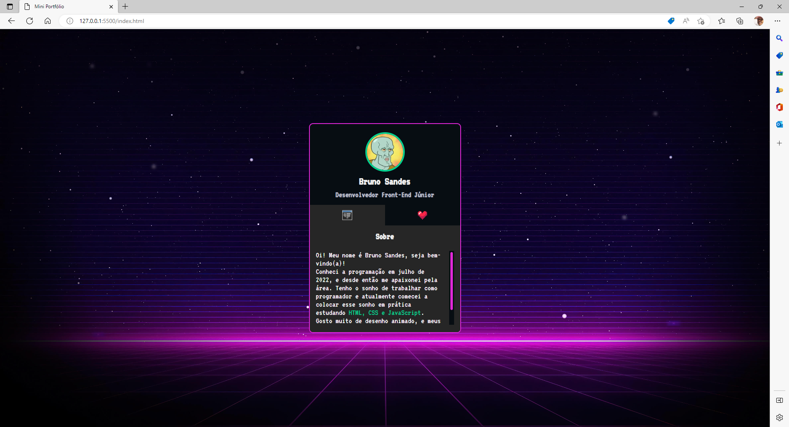

# mini portfólio
## Meu primeiro projeto prático de HTML 5, CSS 3 e JavaScript onde apliquei os conhecimento adquiridos durante a semana MapaDev.

## Acesso

Para acessar o projeto, utilize a url abaixo:

[Link para o projeto](https://bsandes.github.io/mini-**portfolio**)